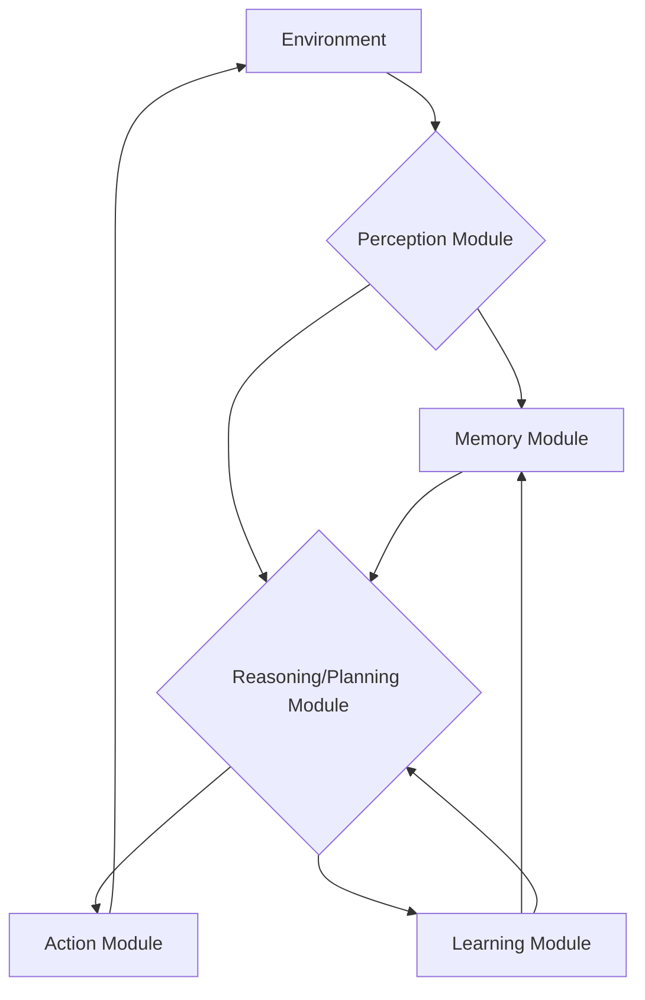

# What is an AI Agent?

An **AI Agent** is an autonomous entity that perceives its environment through sensors and acts upon that environment through effectors to achieve specific goals. Unlike traditional AI programs that execute a predefined set of instructions, agents are designed to be more flexible, adaptable, and capable of making decisions in dynamic and uncertain environments.

## Key Characteristics of AI Agents:

*   **Autonomy**: Agents can operate without constant human supervision, making their own decisions based on their understanding of the environment and their goals.
*   **Perception**: They gather information about their surroundings using various sensors, which can range from simple data inputs to complex sensory data like images or natural language.
*   **Actuation**: Agents perform actions within their environment using effectors. These actions can be physical (e.g., moving a robot arm) or digital (e.g., sending an email, updating a database).
*   **Goal-Oriented**: Agents are designed to achieve specific objectives or optimize certain outcomes. Their actions are directed towards fulfilling these goals.
*   **Learning**: Many advanced AI agents have the ability to learn from their experiences, adapting their behavior and improving their performance over time.
*   **Environment Interaction**: They are constantly interacting with their environment, observing changes, and adjusting their plans and actions accordingly.

## Components of an AI Agent System:

1.  **Perception Module**: Responsible for collecting and interpreting data from the environment.
2.  **Reasoning/Decision-Making Module**: Processes perceived information, evaluates potential actions, and decides on the best course of action to achieve its goals.
3.  **Action Module**: Executes the chosen actions within the environment.
4.  **Knowledge Base (Optional)**: Stores information about the environment, past experiences, and rules that guide the agent's behavior.

### Explanation of Each Component:

1.  **Environment:**
    *   **Description:** This represents the external world or system with which the AI agent interacts. It provides sensory input to the agent and receives actions taken by the agent. The environment can be anything from a simulated game world to the real physical world.
    *   **Role:** The source of all data and the recipient of all actions.

2.  **Perception Module:**
    *   **Description:** This module is responsible for receiving and interpreting sensory information from the environment. It acts as the agent's "eyes" and "ears," translating raw environmental data into a format that the agent can understand and process. This can involve tasks like image recognition, natural language processing, or sensor data interpretation.
    *   **Role:** To gather information from the environment and transform it into a meaningful representation for the agent.

3.  **Memory Module:**
    *   **Description:** The Memory Module stores all relevant information that the agent has accumulated over time. This includes short-term memory (e.g., current observations), long-term memory (e.g., past experiences, learned facts, rules, and goals), and potentially episodic memory (specific events).
    *   **Role:** To retain knowledge and experiences, providing context and data for reasoning and learning.

4.  **Reasoning/Planning Module:**
    *   **Description:** This is the "brain" of the AI agent. It takes the perceived information from the environment, combines it with knowledge from the Memory Module, and uses this to make decisions and plan a sequence of actions. This module might employ various AI techniques such as logical inference, search algorithms, decision trees, or sophisticated planning algorithms to determine the best course of action to achieve its goals.
    *   **Role:** To process information, generate goals, formulate plans, and decide on the next action.

5.  **Action Module:**
    *   **Description:** Once the Reasoning/Planning Module has decided on an action or a sequence of actions, the Action Module is responsible for executing these actions in the environment. This involves translating the agent's internal decisions into concrete outputs that can affect the environment. For example, in a robotic agent, this could involve sending commands to motors; in a software agent, it could be API calls or modifying data.
    *   **Role:** To translate the agent's decisions into observable actions in the environment.

6.  **Learning Module:**
    *   **Description:** This module is crucial for the agent's ability to improve its performance over time. It analyzes the outcomes of actions and feedback from the environment, then updates the agent's knowledge, policies, or strategies stored in the Memory and Reasoning/Planning Modules. Learning can occur through various methods, including reinforcement learning, supervised learning, or unsupervised learning.
    *   **Role:** To adapt and improve the agent's behavior and knowledge based on experience and feedback.